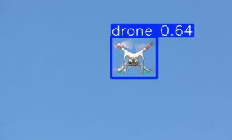

# 🛡️ Real-Time Drone Intrusion Detection using YOLOv11m

> 🎯 A deep learning-based object detection project for aerial intrusion surveillance, using YOLOv11m, trained on a custom drone dataset.

[](https://github.com/ultralytics/ultralytics)
[](https://colab.research.google.com/)
[](#)
[](LICENSE)

---

## 📸 Project Demo

> 🔗 **Live Demo Link**: [Click here](#https://huggingface.co/spaces/abinashp01/prototype-drone-detector-app-ab)
> 🖼️ Sample Prediction:

<p align="center">
  
</p>

---

## 🧠 Overview

This project is designed for **real-time drone detection** in aerial surveillance videos. It uses a custom-trained `YOLOv11m` model capable of detecting drones with high accuracy.

> ⚠️ **Note**: While real-time performance is excellent on GPUs, CPU inference is slower. Recommendations below.

---

## 🔍 Training Summary

| Detail            | Info                                                                                  |
| ----------------- | ------------------------------------------------------------------------------------- |
| **Model Used**    | `YOLOv11m` (medium-sized model)                                                       |
| **Training Time** | ⏱️ First Training: 4.15 hours (40 epochs)<br>⏱️ Second Training: 8+ hours (80 epochs) |
| **Hardware Used** | ⚡ First: Google Colab GPU (Tesla T4)<br>⚡ Second: Local NVIDIA RTX 3050 Laptop GPU    |
| **Model Size**    | 💾 40.5 MB                                                                            |
| **Final Weights** | `/models/2_best.pt`                                                                   |

---

## 🗂️ Dataset Overview

### 📁 Custom Dataset 1

* **Train**: 8378 images
* **Validation**: 1505 images
* **Test**: 65 images

### 📁 Custom Dataset 2

* **Train**: 10359 images
* **Validation**: 2922 images
* **Test**: 1470 images

---

## 📊 Validation Performance (on Custom Dataset 1)

```text
Precision (P):      0.917 ✅  
Recall (R):         0.876 ✅  
mAP@0.5:            0.943 ✅  
mAP@0.5:0.95:       0.661 ✅  
```

---

## 🧮 Model Stats

| Metric     | Value  |
| ---------- | ------ |
| Parameters | 20.0 M |
| Layers     | 125    |
| GFLOPs     | 67.6   |

---

## 📈 Test Set Benchmarking Results

| Model      | Evaluated on     | mAP\@0.5   | mAP\@0.5:0.95 |
| ---------- | ---------------- | ---------- | ------------- |
| 1\_best.pt | Custom Dataset 1 | 0.8956     | 0.6850        |
| 2\_best.pt | Custom Dataset 1 | **0.9824** | **0.7389**    |
| 1\_best.pt | Custom Dataset 2 | 0.8171     | 0.3999        |
| 2\_best.pt | Custom Dataset 2 | **0.9573** | **0.6438**    |

---

## 🏆 Final Model Recommendation

The **`2_best.pt`** model is the best performing across both datasets and is recommended for deployment or downstream tasks.

It was trained via **sequential fine-tuning**:

1. First on **Custom Dataset 1** (40 epochs, 4.15 hours)
2. Then fine-tuned further on **Custom Dataset 2** (80 epochs, 8+ hours)

This led to **significant improvements in generalization and detection accuracy**, achieving:

* **98.2% mAP\@0.5** on Dataset 1
* **95.7% mAP\@0.5** on Dataset 2
* With high mAP\@0.5:0.95 scores on both datasets.

---
## ⚡ Inference Speed

| Device          | Inference Time | FPS (approx) | Real-Time Capable |
| --------------- | -------------- | ------------ | ----------------- |
| **GPU (T4)**    | 11.2 ms/img    | \~75 FPS     | ✅ Yes             |
| **CPU (Colab)** | \~300 ms/img   | \~1–3 FPS    | ❌ No              |

```python
# YOLOv11m inference breakdown on GPU:
Preprocess:   0.3 ms
Inference:   11.2 ms
Postprocess:  1.4 ms
```

---

## 🛠️ Inference Script (Sample)

```python
from ultralytics import YOLO

model = YOLO("models\yolov11m.pt")  # Path to trained model
results = model("sample.jpg", device="cpu")  # or "cuda:0"
results.show()
```

---

## 📁 Directory Structure

```prototype-drone-detector-app-ab/
├── .git/                          # Git version control
├── artifacts/                     # Training artifacts and results
│   ├── model_summary.txt
│   ├── results_summary_exp1.txt
│   ├── confusion_matrix_normalized.png
│   ├── confusion_matrix.png
│   ├── R_curve.png
│   ├── P_curve.png
│   ├── PR_curve.png
│   └── F1_curve.png
├── core/                          # Core application modules
│   ├── __init__.py
│   ├── extract.py                 # Frame extraction functionality
│   ├── predict.py                 # Object detection using YOLO
│   ├── input_frames/              # Extracted video frames (auto-created)
│   ├── output_frames/             # Detection results (auto-created)
│   └── __pycache__/               # Python cache files
├── models/                        # YOLO model files
│   ├── __init__.py
│   └── yolov11m.pt               # YOLOv11 medium model (39MB)
├── notebook/                      # Jupyter notebooks
│   └── custom_model.ipynb        # Model training/development notebook
├── app.py                        # Main Gradio web application
├── requirements.txt              # Python dependencies
├── README.md                     # Project documentation
├── .gitattributes               # Git configuration
├── demo_sample.jpg              # Demo image sample
└── sample.jpg                   # Sample image
```

## 📦 Requirements

* Python ≥ 3.8
* PyTorch ≥ 2.0
* `ultralytics` (YOLOv8/11 compatible)

```bash
pip install ultralytics
```

---

## 🚀 Future Work

* [ ] Deploy `YOLOv11m` on webcam for real-time CPU inference
* [ ] Add a Gradio or Streamlit web demo
* [ ] Optimize for edge devices (Jetson, Raspberry Pi)

---

## 🙋‍♂️ Author

**Abinash Pradhan**
🚀 Aspiring Machine Learning Engineer | CV & Defense AI Projects
📝 Reach me: [LinkedIn](#https://www.linkedin.com/in/abinash-pradhan-a42157297/) | [Twitter](#https://x.com/abinashp01) | [Website](#https://abinashpradhan01.github.io/)

---

## 📄 License

This project is licensed under the APACHE 2.0 License - see the [LICENSE](LICENSE) file for details.

---
