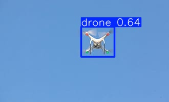
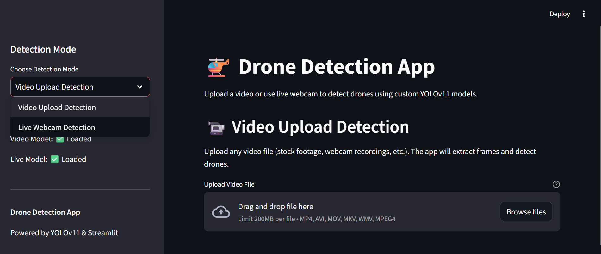
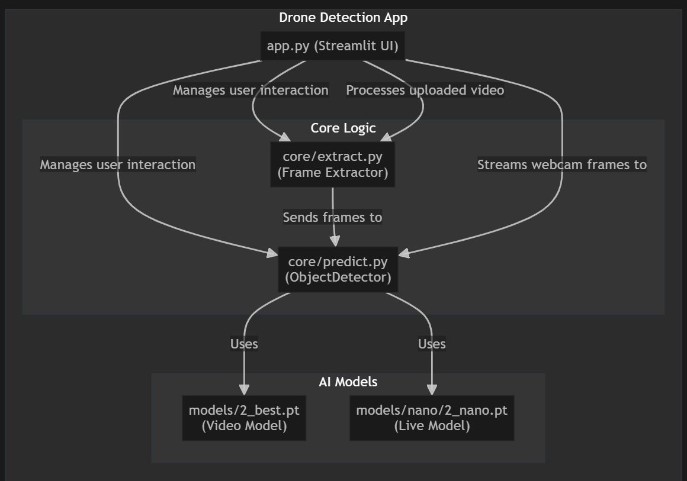

# 🛡️ Real-Time Drone Intrusion Detection System

A sophisticated drone and aerial object detection system powered by custom-trained YOLOv11 models. Designed for real-time surveillance, security, and defense applications with both video analysis and live webcam detection capabilities.

<p align="center">
  
</p>

[](https://github.com/ultralytics/ultralytics)
[](https://realtime-aerial-objects-detection-system.streamlit.app/)
[](LICENSE)
[](https://python.org)

## 🚀 Live Demo

<p align="center">
  
</p>

**[Try the Live Application →](https://realtime-aerial-objects-detection-system.streamlit.app/)**

Experience both detection modes:
- 🎥 **Video Analysis**: High-accuracy detection on uploaded footage
- 📹 **Live Detection**: Real-time webcam monitoring

---

## ✨ Key Features

- **Multi-Object Detection**: Specialized detection of drones, UAVs, and various aerial objects
- **Dual Detection Modes**: Pre-recorded video analysis and live webcam monitoring
- **Custom YOLOv11 Models**: Four specialized models optimized for different deployment scenarios
- **High Performance**: Up to 75 FPS on GPU with optimized inference pipelines
- **Defense-Ready**: Scalable architecture suitable for security and surveillance applications
- **Web Interface**: User-friendly Streamlit dashboard for easy operation
- **Comprehensive Metrics**: Detailed performance benchmarking and model evaluation

## 🎯 Use Cases & Applications

- **Defense & Military**: Perimeter security and threat detection systems
- **Critical Infrastructure**: Airport and restricted airspace monitoring  
- **Border Security**: Unauthorized aerial vehicle detection
- **Research & Development**: Aerial object detection algorithm testing
- **Educational**: Computer vision and object detection learning

> **⚠️ Performance Note**: For mission-critical defense applications requiring ultra-low latency (< 1ms inference), consider implementing **custom CNN architectures** specifically trained for aerial threats, as YOLOv11 models are optimized for general-purpose detection tasks.

## 🏗️ Architecture

### Model Variants

| Model | Architecture | Parameters | Use Case | Performance |
|-------|-------------|------------|----------|-------------|
| `2_best.pt` | YOLOv11m | 20M | Video Analysis | mAP@0.5: 95.73% |
| `2_nano.pt` | YOLOv11n | 2.58M | Real-time Detection | mAP@0.5: 96.26% |
| `1_best.pt` | YOLOv11m | 20M | Base Model | mAP@0.5: 94.30% |
| `1_nano.pt` | YOLOv11n | 2.58M | Lightweight Base | mAP@0.5: 94.80% |

### Training Pipeline

1. **Dataset Collection**: Combined Roboflow datasets with custom-annotated aerial imagery
2. **Base Training**: Models trained on Custom Dataset 1 (8,378 training images)
3. **Fine-tuning**: Enhanced performance using Custom Dataset 2 (10,359 training images)
4. **Custom Annotations**: Manual annotation of specialized aerial objects and edge cases
5. **Validation**: Rigorous testing across multiple test sets and real-world scenarios
6. **Optimization**: Speed-accuracy trade-off optimization for deployment

## 📊 Performance Metrics

### Training Metrics (Validation Results)

**Model Training Performance:**
| Model | Dataset | Epochs | Training Time | mAP@0.5 | mAP@0.5:0.95 |
|-------|---------|--------|---------------|---------|---------------|
| 1_best.pt | Dataset 1 | 40 | ~4.15 hours | 94.30% | 66.10% |
| 2_best.pt | Dataset 2 | 80 | ~8+ hours | **95.73%** | **64.38%** |
| 1_nano.pt | Dataset 1 | 73 | ~8+ hours | 94.80% | 67.80% |
| 2_nano.pt | Dataset 2 | 100 | ~8+ hours | **95.90%** | **66.10%** |

### Test Set Performance

**Custom Dataset 1 Test Results:**
| Model | mAP@0.5 | mAP@0.5:0.95 | Best For |
|-------|---------|--------------|----------|
| 2_nano.pt | **98.63%** | **80.21%** | Real-time Detection |
| 2_best.pt | **98.24%** | 73.89% | High Accuracy |
| 1_nano.pt | 98.63% | 77.50% | Speed Optimization |
| 1_best.pt | 89.56% | 68.50% | Baseline |

**Custom Dataset 2 Test Results:**
| Model | mAP@0.5 | mAP@0.5:0.95 | Deployment Status |
|-------|---------|--------------|-------------------|
| 2_nano.pt | **96.26%** | **66.35%** | ✅ Live Detection |
| 2_best.pt | **95.73%** | **64.38%** | ✅ Video Analysis |
| 1_nano.pt | 79.83% | 39.03% | ⚠️ Needs Fine-tuning |
| 1_best.pt | 81.71% | 39.99% | ⚠️ Needs Fine-tuning |

### Inference Speed

| Platform | Model | Speed | FPS | 
|----------|-------|-------|-----|
| RTX 3050 (Local) | YOLOv11m | ~11.2 ms/image | ~75 |
| RTX 3050 (Local) | YOLOv11n | ~2.6 ms/image | ~75 |
| CPU | Any | ~300 ms/image | ~3 |

## 🛠️ Technology Stack

- **Deep Learning**: PyTorch, Ultralytics YOLOv11
- **Computer Vision**: OpenCV, PIL
- **Web Framework**: Streamlit
- **Development**: Python 3.8+, Google Colab, Local GPU (RTX 3050)
- **Data**: Roboflow (annotation & dataset management)

## 📁 Project Structure

<p align="center">
  
</p>

```
my-app-local/
├── core/                 # Core detection logic
│   ├── extract.py        # Video frame extraction utilities
│   └── predict.py        # Model inference and prediction
├── models/               # Trained YOLOv11 models
│   ├── 2_best.pt         # Primary model for video analysis
│   └── nano/
│       └── 2_nano.pt     # Lightweight model for real-time detection
├── notebook/             # Training notebooks and experiments
├── app.py                # Main Streamlit application
├── requirements.txt      # Python dependencies
└── README.md            # Project documentation
```

## 🚀 Quick Start

### Online Demo
Visit the [live application](https://realtime-aerial-objects-detection-system.streamlit.app/) - no setup required!

### Local Development

1. **Clone the repository**
   ```bash
   git clone <repository-url>
   cd my-app-local
   ```

2. **Install dependencies**
   ```bash
   pip install -r requirements.txt
   ```

3. **Run the application**
   ```bash
   streamlit run app.py
   ```

4. **Access the interface**
   Open `http://localhost:8501` in your browser

## 💡 Model Selection Guide

**For Video Analysis (`2_best.pt`):**
- Higher accuracy for recorded footage
- Best for detailed analysis and reporting
- Suitable when processing time is not critical

**For Real-Time Detection (`2_nano.pt`):**
- Optimized for speed and low latency
- Ideal for live monitoring applications
- Lower resource requirements

## 📈 Training Details

### Dataset Information
- **Dataset 1**: 9,948 total images (8,378 train / 1,505 val / 65 test)
  - Source: Roboflow public datasets + custom annotations
- **Dataset 2**: 14,751 total images (10,359 train / 2,922 val / 1,470 test)  
  - Source: Primarily custom-annotated aerial imagery with specialized edge cases
- **Annotation Process**: Manual labeling of drones, UAVs, and aerial objects
- **Training Infrastructure**: Google Colab T4 GPU + Local RTX 3050
- **Total Training Time**: ~12+ hours across all models

### Training Configuration
- **Base Models**: YOLOv11m (20M params) and YOLOv11n (2.58M params)
- **Training Strategy**: Progressive fine-tuning across datasets
- **Optimization**: Speed-accuracy balance for deployment scenarios

## 🤝 Contributing

We welcome contributions from the community! Here's how you can help improve the project:

### Ways to Contribute
- 🐛 **Bug Reports**: Submit issues for bugs or unexpected behavior
- 💡 **Feature Requests**: Suggest new capabilities or improvements
- 📝 **Documentation**: Help improve guides and documentation
- 🔧 **Code Contributions**: Submit pull requests for new features or fixes
- 📊 **Dataset Contributions**: Share additional annotated aerial imagery

### Development Process
1. **Fork** the repository
2. **Create** a feature branch (`git checkout -b feature/AmazingFeature`)
3. **Commit** your changes (`git commit -m 'Add some AmazingFeature'`)
4. **Push** to the branch (`git push origin feature/AmazingFeature`)
5. **Open** a Pull Request

### Contact for Collaboration
After submitting your contribution, please drop an email to discuss your changes and coordinate development efforts.

**📧 Email**: abinash01pradhan@gmail.com

## 📄 License

This project is licensed under the Apache 2.0 License - see the [LICENSE](LICENSE) file for details.

## 👨‍💻 Author

**Abinash Pradhan**  
*Aspiring Machine Learning Engineer | Computer Vision & Defense AI*

[](https://www.linkedin.com/in/abinash-pradhan-a42157297/)
[](https://x.com/abinashp01)
[](https://abinashpradhan01.github.io/)

---

## 🙏 Acknowledgments

- [Ultralytics](https://github.com/ultralytics/ultralytics) for the YOLOv11 framework
- [Streamlit](https://streamlit.io/) for the deployment platform  
- [Roboflow](https://roboflow.com/) for dataset management and public datasets
- Google Colab for providing GPU resources for model training
- Defense and security research community for inspiration and use case guidance

---

*Built with ❤️ for aerial surveillance and defense applications*

> **🚀 Future Roadmap**: Exploring custom CNN architectures for ultra-low latency defense applications